export { notes as theme } from '@mdx-deck/themes'
import Footer from 'components/Footer'
import { Title } from 'components/Title'

# React to Web Workers

##### Tyler Clark

---

# 👋 Nice to meet ya

- Full stack software engineer: @pluralsight

- Video courses: @eggheadio

- Twitter: @iamtylerwclark

---

<Title text="Overview" />

- What are workers? (web and service)

- Service worker notes & demo

- Web worker notes & demo

- Tips / Tricks / Additional References

<Footer />

---

# Why tho?

> A service worker, properly configured, makes your web app fast and reliable.

> -Jeff Posnick

---

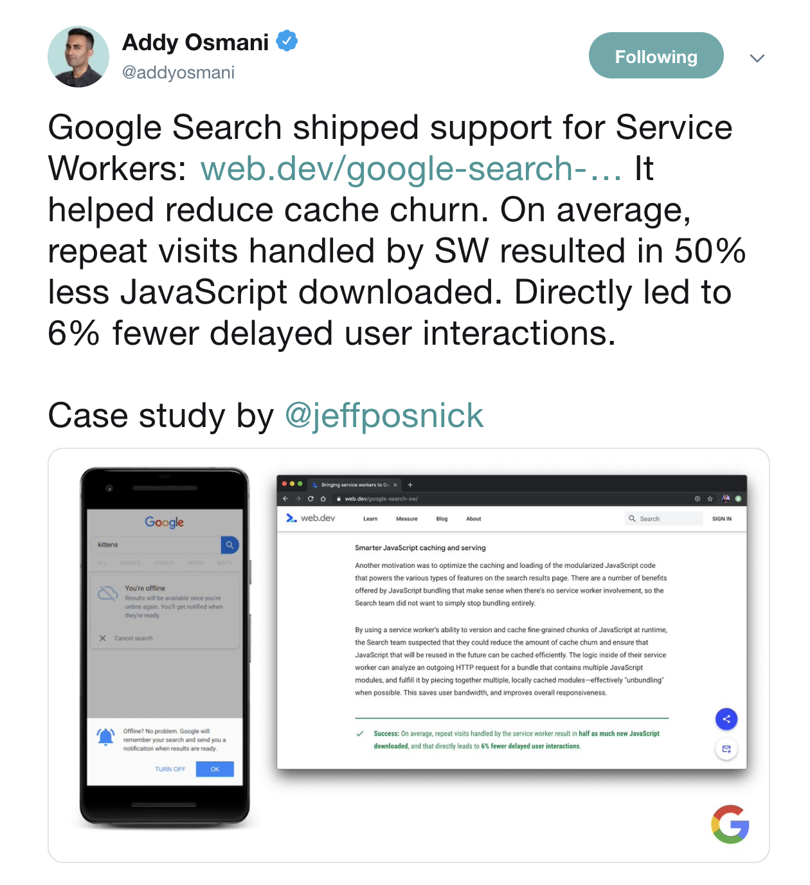

---

## Let's get our terminology right :white_check_mark:

<Footer />

---

## Web worker vs. Service worker

- All are "workers"
- Dedicated & Shared workers = "Web worker"
- Service worker = "Service worker"

<Footer />

---

# What are workers?

- Run scripts in another thread
- Can communicate with client app
- Kindof like a browser extension
- Sits in middle of client and server

<Footer />

---

## Not all :rose:

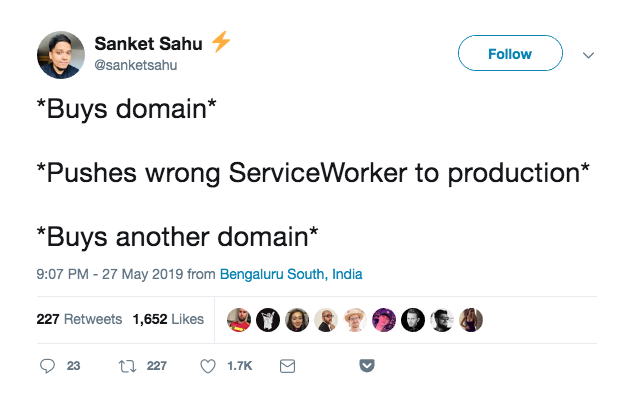

<Footer />

---

# Workers: Cons :thumbsdown:

- Sticky cache (Browser refresh doesn't do anything)
- No access to localStorage, some window properties, or DOM
- Little to no IE support
- Steep learning curve (i.e Webpack / Parcel)

<Footer />

---

# Workers: Pros :rocket:

- Catch offline requests\*
- Prefetching resources\*
- Handle complex UI blocking functions\*
- Push notifications
- Built in thread safety

<Footer />

---

# How to ANY worker :raising_hand:

- You can use normal JS syntax (For the most part)
- Reference a JS file or script type="text/js-worker"
- IndexedDB
- WebSockets :scream:

<Footer />

---

# How to WEB WORKER

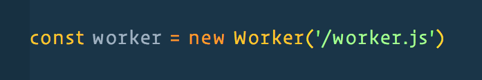

- Messages control communication
- postMessage & onmessage
- Can also use eventListeners('message')

<Footer />

---

# How to SERVICE WORKER

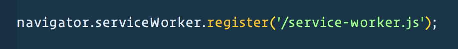

<Footer />

---

## How to SERVICE WORKER

- Uses variety of eventListeners ('install', 'fetch', 'message')
- Works off Promises
- Have lifecycle events (Causes most confusion)

<Footer />

---

## SERVICE WORKER :muscle:

- Cache API + _Intercepting Fetch_ = offline experience

<Footer />

---

### Caching Assets with Workbox & Cache API

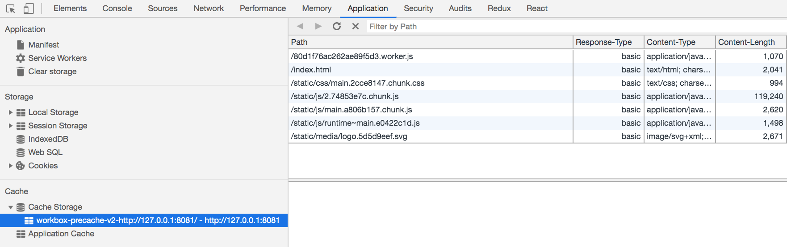

<Footer />

---

<Title text="Service Worker" />

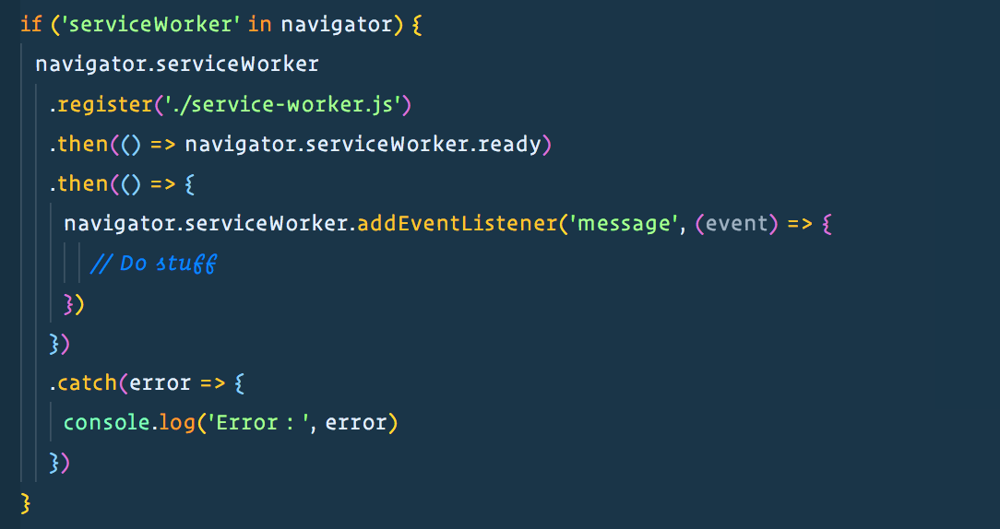

<Footer />

---

<Title text="Sync state across tabs" />

    `
  }}
/>

<Footer />

---

> Workbox is a library that bakes in a set of best practices and removes the boilerplate every developer writes when working with service workers.

<Footer />

---

## Why Workbox?

- Precaching
- Runtime caching
- Request routing
- Background sync
- Helpful debugging

---

## Easy implementation

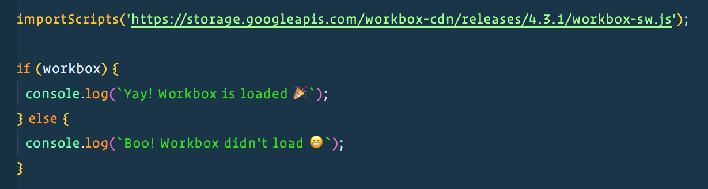

---

## Simple and Complex Recipes

- Caching CSS / JS / Images
- Caching from multiple origins
- Offer page reload
- Provide a fallback responses (images, document, font)

---

# React :heart: Workers

<Footer />

---

# create-react-app v2

- Introduced opt-in with _Google's Workbox_ (GenerateSW)
- All static site assets are cached (cached first)
- App works offline

<Footer />

---

# CRA Non-opted in demo

1. `npm run build`
2. `cd build/`
3. `http-server`

<Footer />

---

    `
  }}
/>

<Footer />

---

# CRA demo opted-In

1. `cd ..`
2. Register default service worker

<Footer />

---

# CRA demo opted-In

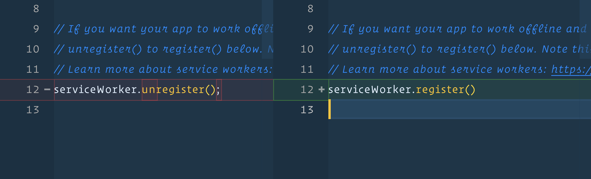

<Footer />

---

# CRA demo opted-In

1. `npm run build`
2. `cd build/`
3. `http-server`

<Footer />

---

    `
  }}
/>

<Footer />

---

# That's it! :clap:

<Footer />

---

# Warning :grimacing:

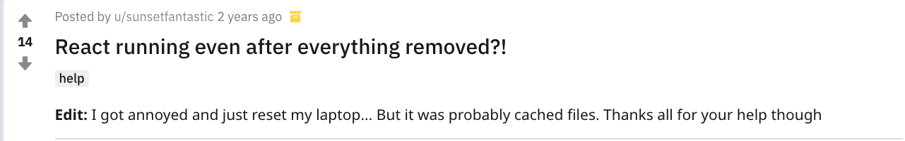

<Footer />

---

# CRA service-worker gotchas

- Service worker is kept in "waiting" state
- Users have to close tabs (not reload)
- "New content is available once existing tabs are closed"

<Footer />

---

# CRA notes

- App can be added to phone
- Assets have cache-first strategy
- Cached navigation requests for your HTML

<Footer />

---

## Customize workbox GenerateSW in CRA

#### Coming soon?

- Custom workbox config file [Initial Proposal](https://github.com/facebook/create-react-app/issues/5359)
- Sitting with changes requested [Pull request ](https://github.com/facebook/create-react-app/pull/5369)

<Footer />

---

## Can use InjectManifest without ejecting

- Gives more control (skipWaiting()) :white_check_mark:
- Use other APIs such as Web Push :white_check_mark:
- Relatively easy to add in CRA :white_check_mark:
- See references page at end

<Footer />

---

# Service Worker Notes

- Lifecycle (installing, installed, waiting, active, activated... )
- Not transparent if installation fails

---

# On to Web Workers in CRA

- Eject CRA
- Use react-app-rewired + worker-plugin
- [Pull request for Web Workers support](https://github.com/facebook/create-react-app/pull/5886)

<Footer />

---

### Thread blocking demo

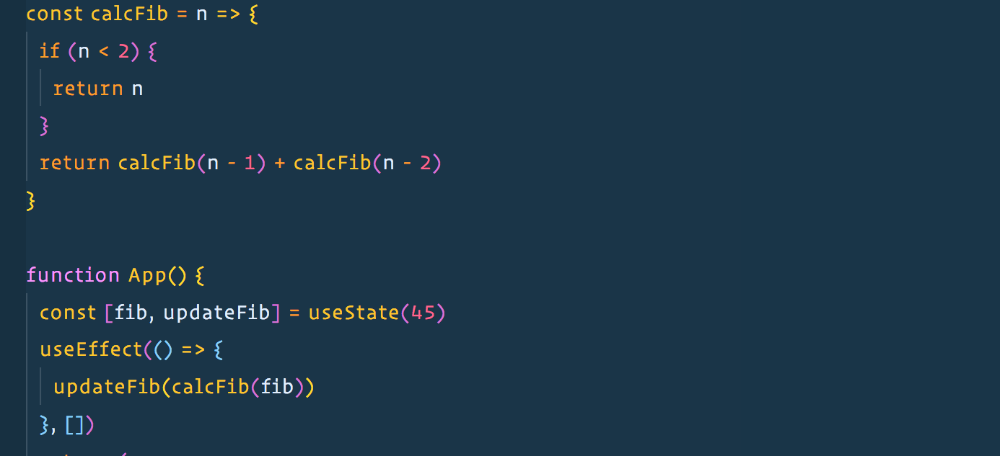

<Footer />

---

<Title text="Thread blocking demo" />

    `
  }}
/>

<Footer />

---

### App.js

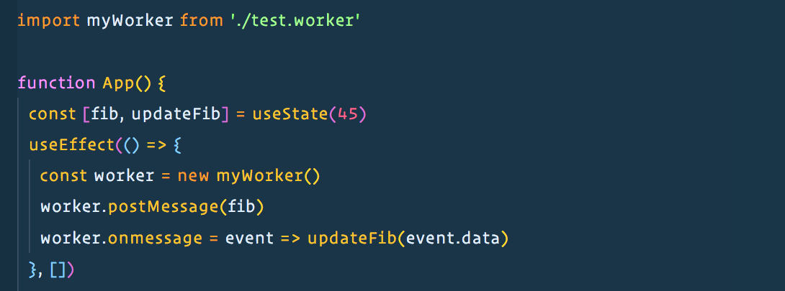

<Footer />

---

### test.worker.js

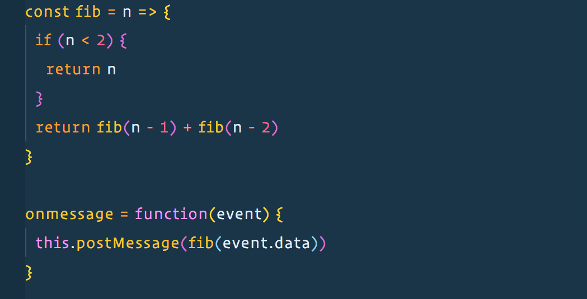

<Footer />

---

<Title text="Non-thread blocking demo" />

    `
  }}
/>

<Footer />

---

<Title text="Notes on Web Workers" />

- Dedicated worker is only accessible by the script that called it (new Worker())
- Shared workers accessible by multiple scripts (new SharedWorker())
- Can destroy with `myWorker.terminate()`

<Footer />

---

<Title text="Notes on Web Workers" />

- Can create "sub-workers"
- Have access to global function, importScripts()

<Footer />

---

# Tips and tricks

- Testing locally run in incognito tab
- Only works with HTTPS or localhost
- Workbox CLI

<Footer />

---

# References

- [Progressive Web Apps CRA](https://facebook.github.io/create-react-app/docs/making-a-progressive-web-app)
- [WorkBox](https://developers.google.com/web/tools/workbox/)
- [Custom workbox config CRA Initial Proposal](https://github.com/facebook/create-react-app/issues/5359)
- [Custom workbox config CRA Pull request ](https://github.com/facebook/create-react-app/pull/5369)

<Footer />

---

# References

- [Web worker vs. Service Worker](https://bitsofco.de/web-workers-vs-service-workers-vs-worklets/)
- [Prefetch links](https://blog.bitsrc.io/prefetching-links-using-service-workers-d9f6babfd0b)
- [Web Workers support in CRA](https://github.com/facebook/create-react-app/pull/5886)
- [Worker Plugin](https://github.com/GoogleChromeLabs/worker-plugin)

<Footer />

---

# Thanks! :raised_hands:

<Footer />
